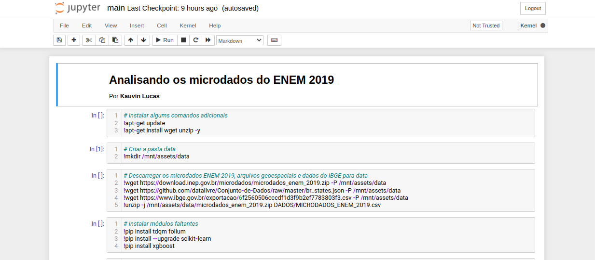
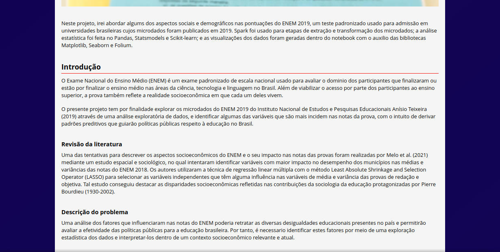

 

### Para instruções e outras informações em português, por favor vá ao seguinte [link](LEIA-ME.md).

***Project start date:** December 4, 2021

***Project end date:** December 8, 2021

# ENEM 2019 data analysis with PySpark
This is a data analysis project done in a Jupyter notebook. I'll try to address some of the social and demographic aspects on the scores of the ENEM 2019, a standardized test used for admission in Brazilian colleges published in 2019. PySpark was used for the data ingestion and cleaning steps; statistical analysis was performed with Pandas, Statsmodels and Scikit-learn; and visualizations were generated inside the notebook with the help of the Matplotlib, Seaborn and Folium libraries.

The notebook (which is written in Portuguese) of this project can be found [here](src/main.ipynb). A HTML report (in Portuguese) of the project is called index.html in the root folder.

# How to use this repository
Instructions on how to execute the notebook can be found [here](docs/en.md). You may use Docker and docker-compose if you don't have Apache Spark installed in your machine.

